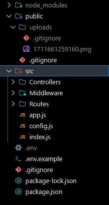

### API-GAMES

# Herramientas utilizadas:

* JWT
* bcryptjs
* express
* mongoose
* multer

# Estructura de carpetas:
    -> Crea las carpetas faltantes
</img>

# Indicaciones:

    -> Tener mongodb
    -> Al descargar el repositorio abrirlo en visual studio code
    -> Primero en la terminal agregar el siguiente comando 'npm i'
    -> Crear .env y tomar las variables de .env.example
    -> Crea tus variables de entorno
    -> Empieza a crear tus usuarios y juegos 